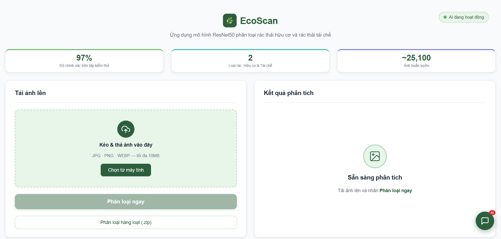
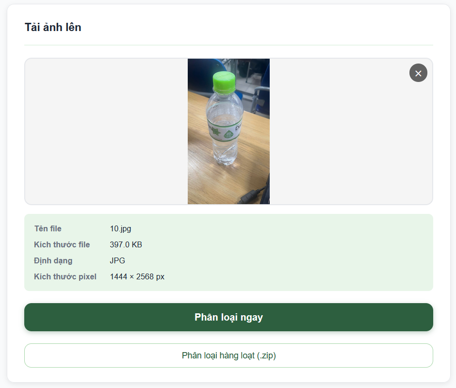
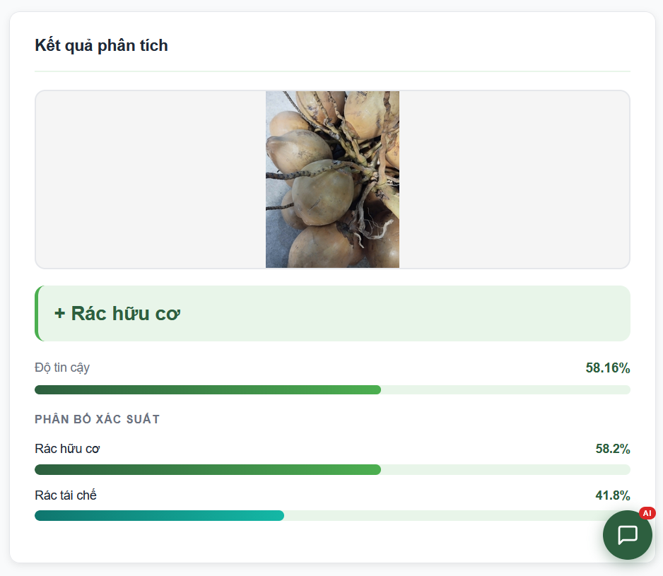
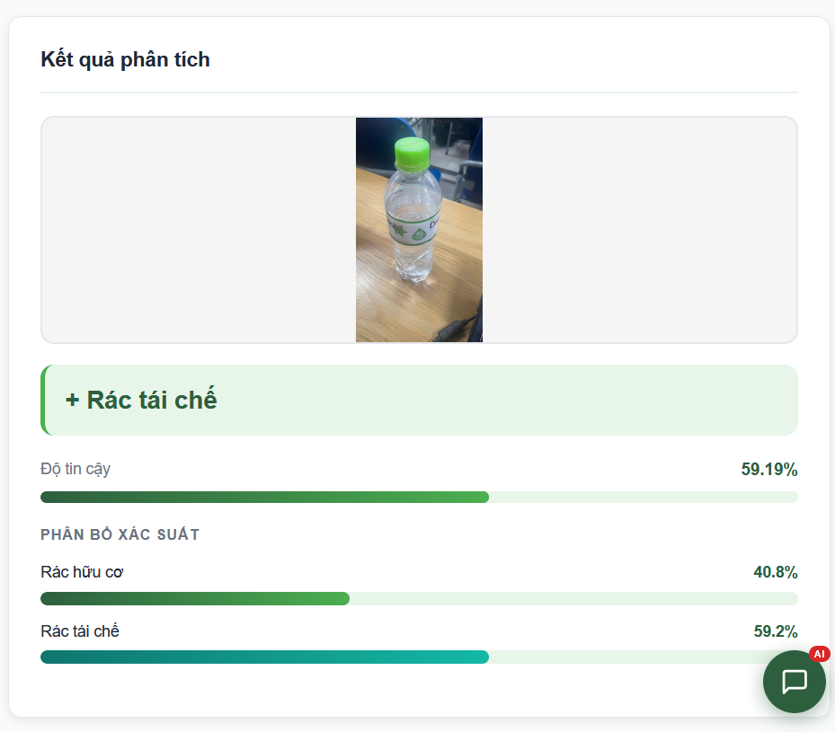
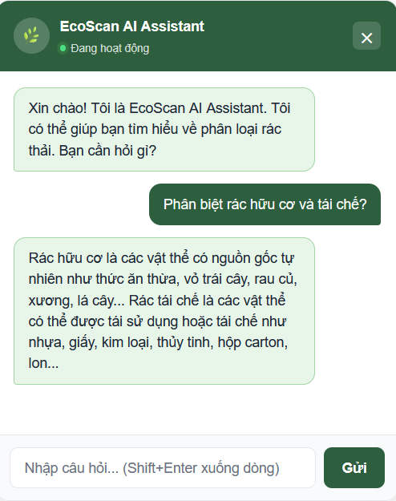
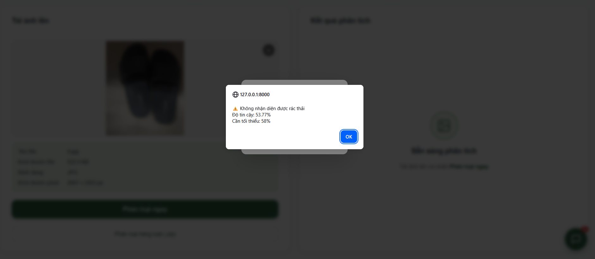

@"
# 🌿 EcoScan - AI Waste Classification App

**Ứng dụng phân loại rác thải thông minh sử dụng Deep Learning**

[Demo](#demo) • [Features](#features) • [Installation](#installation) • [Usage](#usage) • [API](#api-documentation)

---

## 📖 Giới thiệu

EcoScan là ứng dụng web phân loại rác thải tự động sử dụng mô hình ResNet50, giúp người dùng phân biệt **rác hữu cơ** và **rác tái chế** chỉ bằng một cú chụp ảnh.

### 🎯 Thống kê

- **97%** - Độ chính xác trên tập kiểm thử
- **2** - Loại rác: Hữu cơ & Tái chế
- **~25,100** - Ảnh huấn luyện từ dataset Kaggle

---

## ✨ Tính năng

### 🔍 Phân loại thông minh
- Upload ảnh hoặc kéo-thả
- Phân loại tức thì với độ tin cậy cao
- Hiển thị biểu đồ xác suất chi tiết

### 🤖 AI Chatbot
- Tư vấn về phân loại rác thải
- Hỗ trợ tiếng Việt
- Powered by Groq API (Llama 3.3)

### 📊 Giao diện hiện đại
- Responsive design
- Dark mode support
- Minimal & clean UI

---

## 🛠️ Tech Stack

### Backend
- **FastAPI** - Web framework
- **PyTorch** - Deep learning
- **ResNet50** - CNN architecture
- **Groq API** - LLM chatbot

### Frontend
- **HTML5/CSS3/JavaScript**
- **Vanilla JS** (no framework)
- **Responsive Design**

### Dataset
- **Source**: [Kaggle - Waste Classification Data](https://www.kaggle.com/datasets/techsash/waste-classification-data)
- **Classes**: Organic (O), Recyclable (R)
- **Images**: ~25,100 training images

---

## 📦 Cài đặt

### 1. Clone repository

\`\`\`bash
git clone https://github.com/franceto/ecoscan-app.git
cd ecoscan-app
\`\`\`

### 2. Tạo môi trường ảo

\`\`\`bash
python -m venv .venv
.venv\Scripts\activate  # Windows
source .venv/bin/activate  # Linux/Mac
\`\`\`

### 3. Cài đặt dependencies

\`\`\`bash
pip install -r requirements.txt
\`\`\`

### 4. Download mô hình ResNet50

**Tải file model** từ [Google Drive](https://drive.google.com/YOUR_LINK) và đặt vào:

\`\`\`
backend/models/resnet50_waste.pth
\`\`\`

### 5. Cấu hình Groq API

Sửa file \`backend/config.py\`:

\`\`\`python
GROQ_API_KEY = "your-groq-api-key-here"
\`\`\`

---

## 🚀 Sử dụng

### Chạy server

\`\`\`bash
python -m backend.main
\`\`\`

Server sẽ chạy tại: **http://localhost:8000**

### Test API

\`\`\`bash
curl -X POST http://localhost:8000/api/classify \
  -F "file=@test_image.jpg"
\`\`\`

---

## 📸 Screenshots

### Giao diện chính

### Upload ảnh

### Kết quả phân loại - Rác hữu cơ

### Kết quả phân loại - Rác tái chế

### AI Chatbot

### Xử lý lỗi

---

## 📡 API Documentation

### POST /api/classify

**Request:**
\`\`\`
Content-Type: multipart/form-data
file: <image_file>
\`\`\`

**Response (Success):**
\`\`\`json
{
  "class": "O",
  "class_name": "Rác hữu cơ",
  "confidence": 95.5,
  "description": "Rác hữu cơ bao gồm thực phẩm thừa..."
}
\`\`\`

**Response (Low Confidence):**
\`\`\`json
{
  "type": "not_waste",
  "error": "Không nhận diện được rác thải",
  "confidence": 45.2
}
\`\`\`

### POST /api/chat

**Request:**
\`\`\`json
{
  "message": "Phân biệt rác hữu cơ và tái chế như thế nào?"
}
\`\`\`

**Response:**
\`\`\`json
{
  "response": "Rác hữu cơ là..."
}
\`\`\`

---

## 📁 Cấu trúc thư mục

\`\`\`
Ecoscan_app/
├── backend/
│   ├── models/           # Model files (.pth)
│   ├── routes/           # API endpoints
│   ├── utils/            # Helper functions
│   ├── config.py         # Configuration
│   └── main.py           # FastAPI app
├── frontend/
│   ├── static/
│   │   ├── css/          # Stylesheets
│   │   ├── js/           # JavaScript
│   │   └── images/       # Assets
│   └── templates/
│       └── index.html    # Main page
├── uploads/              # Temp upload folder
├── requirements.txt      # Python dependencies
├── .gitignore
└── README.md
\`\`\`

---

## 🤝 Contributing

Contributions are welcome! Please:

1. Fork the project
2. Create your feature branch (\`git checkout -b feature/AmazingFeature\`)
3. Commit your changes (\`git commit -m 'Add AmazingFeature'\`)
4. Push to the branch (\`git push origin feature/AmazingFeature\`)
5. Open a Pull Request

---

## 📝 License

Distributed under the MIT License. See \`LICENSE\` for more information.

---

## 👥 Authors

**franceto (ANH PHAP TO)** - (https://github.com/franceto)

---

## 🙏 Acknowledgments

- Dataset: [Waste Classification Data - Kaggle](https://www.kaggle.com/datasets/techsash/waste-classification-data)
- Model Architecture: ResNet50 (PyTorch)
- LLM API: Groq (Llama 3.3)

---

**⭐ Nếu project hữu ích, hãy cho một star nhé! ⭐**

Made with ❤️ by Franceto (ANH PHAP TO)

"@ | Out-File -FilePath README.md -Encoding utf8