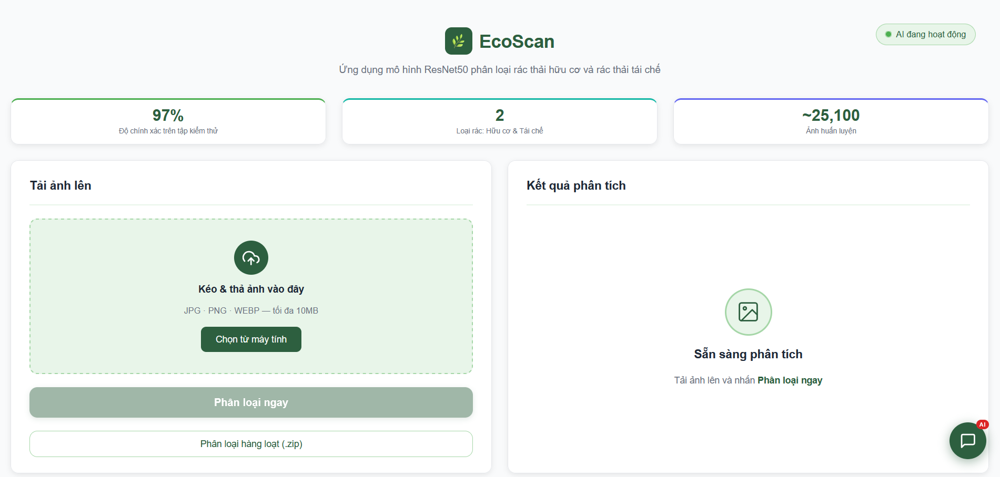
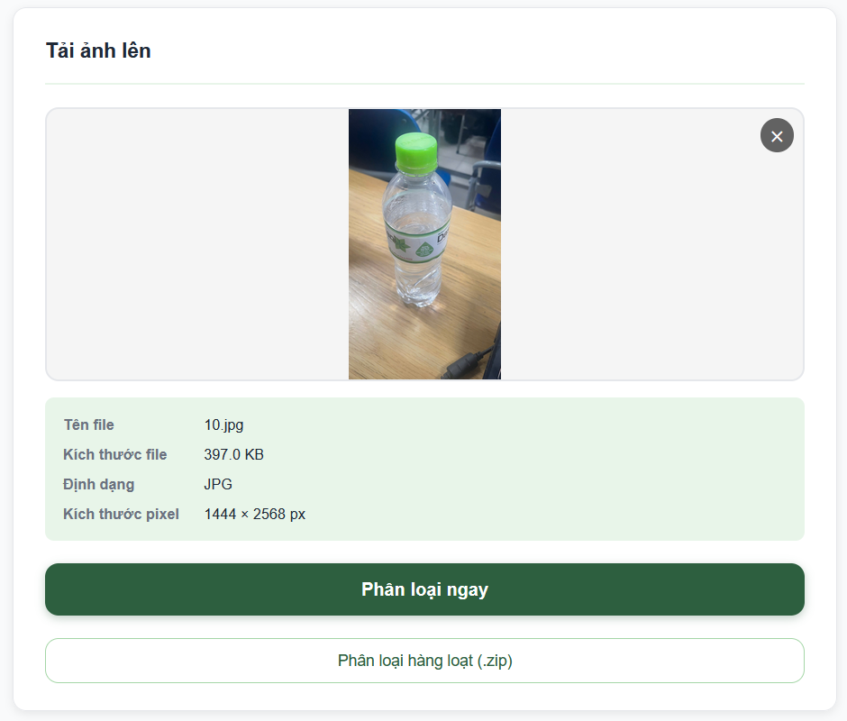
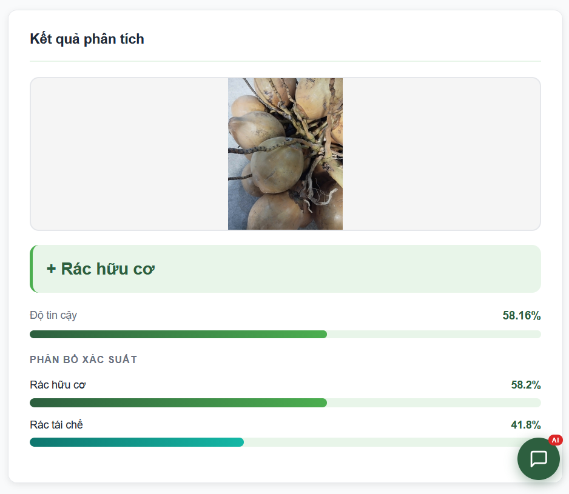
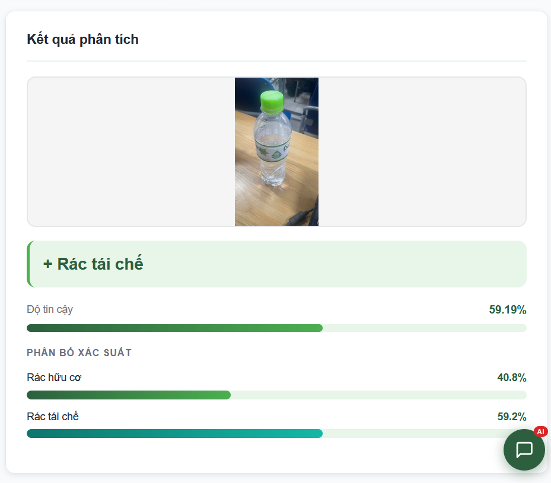
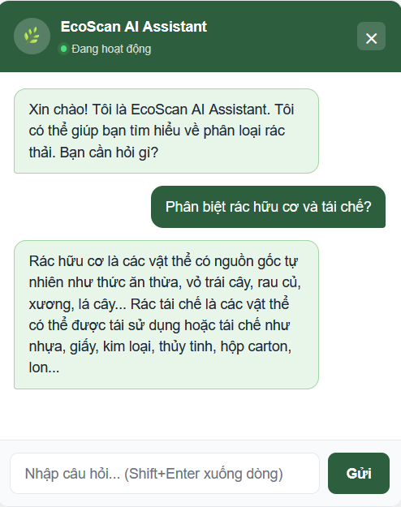

# EcoScan - AI Waste Classification App

<div align="center">

<!-- Banner / Screenshot placeholder -->


<br/>

**Ứng dụng web phân loại rác thải hữu cơ và tái chế bằng Deep Learning.**

<br/>


</div>

---

## 1. Project Title & Catchphrase

**EcoScan** giúp người dùng nhận diện nhanh rác thải thuộc nhóm **hữu cơ** hoặc **tái chế** thông qua ảnh đầu vào.

Dự án kết hợp mô hình **ResNet50**, giao diện web **FastAPI**, và chatbot tư vấn phân loại rác bằng **Groq API / Llama 3.3**.

---

## 2. Quick Demo & Visuals

<div align="center">

[Live Demo Web App](#) · [Video Demo](#) · [Source Code](https://github.com/franceto/ecoscan-app)

<br/><br/>


</div>

---

## 3. Tính Năng Nổi Bật

- **Phân loại ảnh rác thải:** upload ảnh hoặc kéo-thả để dự đoán rác hữu cơ và rác tái chế.
- **Dự đoán nhanh:** trả về nhãn, độ tin cậy và mô tả phân loại.
- **Biểu đồ xác suất:** hiển thị trực quan mức độ tin cậy của từng lớp.
- **AI Chatbot tiếng Việt:** tư vấn cách phân loại rác bằng Groq API.
- **Giao diện web hiện đại:** responsive, tối giản, dễ sử dụng trên nhiều thiết bị.

---

## 4. Công Nghệ Sử Dụng

<div align="center">


</div>

---

## 5. Triển Khai Nhanh

**Prerequisites**

- Python 3.11+
- File model `resnet50_waste.pth`
- Groq API key nếu sử dụng chatbot

```bash
# Clone repository
git clone https://github.com/franceto/ecoscan-app.git
cd ecoscan-app

# Tạo và kích hoạt môi trường ảo
python -m venv .venv
.venv\Scripts\activate

# Cài đặt thư viện phụ thuộc
pip install -r requirements.txt

# Đặt model vào đúng thư mục
# backend/models/resnet50_waste.pth

# Cấu hình Groq API key trong backend/config.py
# GROQ_API_KEY = "your-groq-api-key-here"

# Khởi chạy ứng dụng
python -m backend.main
```

Ứng dụng chạy mặc định tại:

```text
http://localhost:8000
```

---

## 6. Tài Liệu Dự Án

### Dataset

| Hạng mục | Thông tin |
|---|---|
| Nguồn dữ liệu | Kaggle - Waste Classification Data |
| Số lớp | 2 |
| Nhãn | Organic, Recyclable |
| Số ảnh huấn luyện | Khoảng 25,100 ảnh |
| Mô hình sử dụng | ResNet50 |
| Độ chính xác test | Khoảng 97% |

Dataset: [Waste Classification Data](https://www.kaggle.com/datasets/techsash/waste-classification-data)

### API Endpoints

#### POST `/api/classify`

Phân loại ảnh rác thải.

**Request**

```text
Content-Type: multipart/form-data
file: image_file
```

**Response**

```json
{
  "class": "O",
  "class_name": "Rác hữu cơ",
  "confidence": 95.5,
  "description": "Rác hữu cơ bao gồm thực phẩm thừa..."
}
```

#### POST `/api/chat`

Gửi câu hỏi cho chatbot tư vấn phân loại rác.

**Request**

```json
{
  "message": "Phân biệt rác hữu cơ và rác tái chế như thế nào?"
}
```

**Response**

```json
{
  "response": "Rác hữu cơ thường là thực phẩm thừa, lá cây..."
}
```

### Screenshots

<div align="center">


<br/><br/>

<br/><br/>

<br/><br/>

<br/><br/>


</div>

### Project Structure

```text
Ecoscan_app/
├── backend/
│   ├── models/           # Model files (.pth)
│   ├── routes/           # API endpoints
│   ├── utils/            # Helper functions
│   ├── config.py         # Configuration
│   └── main.py           # FastAPI app
├── frontend/
│   ├── static/
│   │   ├── css/          # Stylesheets
│   │   ├── js/           # JavaScript
│   │   └── images/       # Assets
│   └── templates/
│       └── index.html    # Main page
├── uploads/              # Temp upload folder
├── requirements.txt      # Python dependencies
├── .gitignore
└── README.md
```

### Contributing

```bash
# Fork repository trên GitHub

# Tạo branch mới
git checkout -b feature/your-feature-name

# Commit thay đổi
git commit -m "Add your feature"

# Push branch
git push origin feature/your-feature-name
```

Sau đó mở Pull Request để đóng góp.

### License

Dự án được phân phối theo giấy phép **MIT License**. Xem thêm trong file `LICENSE`.

### Author

**franceto (ANH PHAP TO)**  
GitHub: [https://github.com/franceto](https://github.com/franceto)

### Acknowledgments

- Dataset: [Waste Classification Data - Kaggle](https://www.kaggle.com/datasets/techsash/waste-classification-data)
- Model Architecture: ResNet50
- Deep Learning Framework: PyTorch
- Backend Framework: FastAPI
- LLM API: Groq / Llama 3.3

---

<div align="center">

Nếu hữu ích, hãy cho repository một sao.

Made by **Franceto (ANH PHAP TO)**

</div>
